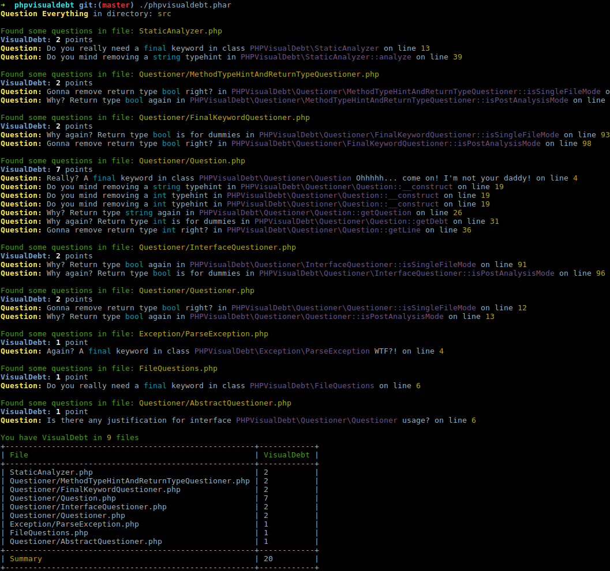
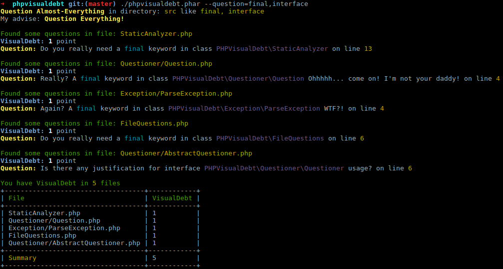

#  PHPVisualDebt
Static Analyzer following QDD which
Question Everything what is leaving Visual Debt behind.

Feel free to interpret QDD as you want! It could be Question Driven Development same as Question Disaster Development!


[](https://travis-ci.org/phpvisualdebt/phpvisualdebt)
[](https://packagist.org/packages/phpvisualdebt/phpvisualdebt)
[](https://packagist.org/packages/phpvisualdebt/phpvisualdebt)
[](https://packagist.org/packages/phpvisualdebt/phpvisualdebt)
[](https://coveralls.io/github/phpvisualdebt/phpvisualdebt?branch=master)

---

## Features

This tool provide static analysis for source code following best QDD practices.

* interface questioner - asks a question for justification of single interface usage
* `final` keyword - asks a question for need of a keyword
* scalar typehints and requrn types questioner - asks a question if one of typehints before PHP7 was used

## Installation

Install with Composer

```
composer require phpvisualdebt/phpvisualdebt
```

Or download `phpvisualdebt.phar` from last [release](https://github.com/phpvisualdebt/phpvisualdebt/releases).

## Usage

Analyzing code:
```bash
bin/phpvisualdebt
```



For those who are not sure to question everything, there is an additional option `--question` which default value is `everything`.
Possible values are comma separated list of: `final`, `interface` or/and `typehint`.
```bash
bin/phpvisualdebt --question=final,interface
```



## License

The MIT License (MIT)

Copyright (c) 2017 Michał Brzuchalski <michal.brzuchalski@gmail.com>

Permission is hereby granted, free of charge, to any person obtaining a copy
of this software and associated documentation files (the "Software"), to deal
in the Software without restriction, including without limitation the rights
to use, copy, modify, merge, publish, distribute, sublicense, and/or sell
copies of the Software, and to permit persons to whom the Software is
furnished to do so, subject to the following conditions:

The above copyright notice and this permission notice shall be included in
all copies or substantial portions of the Software.

THE SOFTWARE IS PROVIDED "AS IS", WITHOUT WARRANTY OF ANY KIND, EXPRESS OR
IMPLIED, INCLUDING BUT NOT LIMITED TO THE WARRANTIES OF MERCHANTABILITY,
FITNESS FOR A PARTICULAR PURPOSE AND NONINFRINGEMENT. IN NO EVENT SHALL THE
AUTHORS OR COPYRIGHT HOLDERS BE LIABLE FOR ANY CLAIM, DAMAGES OR OTHER
LIABILITY, WHETHER IN AN ACTION OF CONTRACT, TORT OR OTHERWISE, ARISING FROM,
OUT OF OR IN CONNECTION WITH THE SOFTWARE OR THE USE OR OTHER DEALINGS IN
THE SOFTWARE.